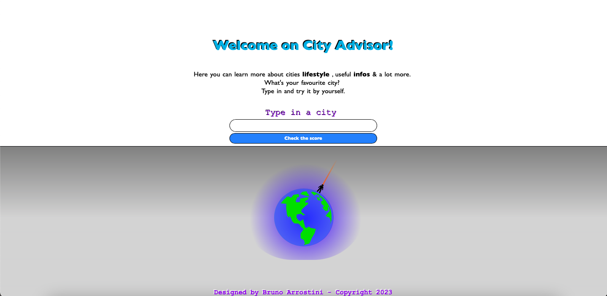

# CityAdvisor 

## Overview 📖
**City Advisor**  is a single page app where yo can type in a city name and it will display an image & some info about the city. 

There's a button that allows to submit the form and shows :

* City global score
* An image of the city
* A city summary
* City lifetsyle categories with scores

City name must be typed in english, if not an error text will display.

Error text specifies taht city name couldn't be in the list as well.

I chose a simple style with strong colors and a globe image to catch user attention.

The app is very useful and entertaining.

## Features 📝

This app has been created using Javascript, Html & Css.

I decided to use Axios .get tool in order to make easier fetching api datas.

Talking about Api I used Teleport Api services to get scores and images of the cities.

Css file has been used to style the page and to set media query to get a responsive design on mobile too.

## Link 🔗

Clicking on the globe below you'll go quicly to the page:

## License 

City Advisor is licensed by <a href="https://github.com/BrunoArrostini/counter/blob/main/LICENSE.md"> MIT LICENSE.
